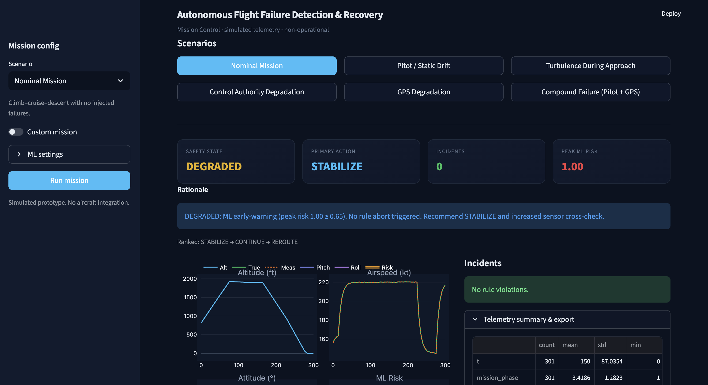
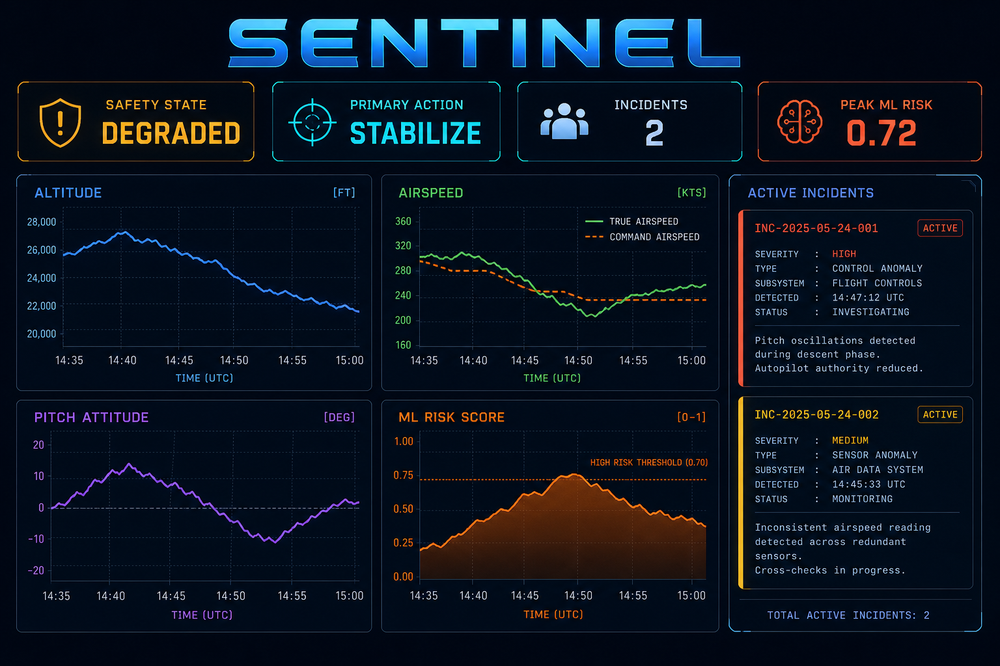

# Autonomous Flight Failure Detection & Recovery System

A rule-based and ML-assisted safety assurance prototype integrated with a Streamlit mission console. Simulates autonomous flight telemetry, injects representative failure modes, and produces explainable safety states and recovery recommendations for human-in-the-loop decision support.



> **NON-OPERATIONAL** — Simulated telemetry only. No aircraft integration, no actuator commands, no classified system replication.

---

## System Snapshot

- **Purpose:** Detect and rank recovery responses to simulated flight faults before crew or operator action  
- **Approach:** Deterministic rule detection + advisory Isolation Forest risk scoring + recovery state machine  
- **Scale:** 50+ telemetry channels, 300 s missions @ 1 Hz, 33 injectable failure modes, 6 built-in stress presets  
- **Output:** Safety classification (`NOMINAL` / `DEGRADED` / `CRITICAL` / `EMERGENCY`) with ranked actions and plaintext explanations  
- **Stack:** Python simulation pipeline, JSON/Markdown data contracts, Streamlit + Plotly frontend  

---

## Overview

This system simulates phased flight missions (takeoff through approach), injects sensor, control, and environmental faults, and presents detection and recovery outputs in an interactive mission console. It was built as a modular assurance prototype for exploring autonomy safety logic under degraded conditions.

The framework is designed as a separable assurance stack that:

- Models **50+ telemetry channels** across climb, cruise, descent, and approach  
- Supports **33 timed failure injection modes** (air data, GNSS, controls, propulsion, compounds)  
- Runs **deterministic envelope and trend rules** with subsystem-tagged incidents  
- Computes **normalized ML risk scores** (`ml_risk ∈ [0, 1]`) from an early nominal training window  
- Classifies mission safety into four states with six ranked recovery actions  
- Generates interpretable rationale for every incident and policy decision  
- Exports structured JSON/Markdown incident reports from the console  

Simulation logic, detection, diagnosis, policy, and visualization are coupled through structured data contracts, enabling future replacement of the simulator with recorded flight data or hardware-in-the-loop feeds without rewriting the assurance layer.

---

## Real-World Context

Autonomous aircraft and UAS operations depend on consistent air data, navigation, and control authority. Representative failure mechanisms include:

- Pitot/static drift producing **8–15+ kt** airspeed disagreement before crew awareness  
- GPS degradation during approach with growing position uncertainty  
- Control surface lag or reduced effectiveness under turbulence or icing proxies  
- Compound sensor disagreement stressing cross-check procedures  

Traditional monitoring often:

- Relies on fixed thresholds without mission-phase context  
- Provides limited root-cause linkage across subsystems  
- Lacks a single view of rules, ML early warning, and ranked recovery options  

This system enables timed fault injection, explainable incident logging, and constraint-aware recovery ranking in a controlled simulated environment.

---

## System Architecture

The pipeline is organized into the following stages:

1. Mission Telemetry Simulation  
2. Timed Failure Injection  
3. Feature Engineering  
4. Rule-Based Anomaly Detection  
5. Advisory ML Risk Scoring (Isolation Forest)  
6. Root-Cause Diagnosis (heuristic)  
7. Safety State Machine & Recovery Policy  
8. Explanation & Incident Reporting  
9. Streamlit Mission Control Layer  

Each layer is modular and loosely coupled, allowing independent testing and future integration of alternate estimators or data sources.

---

## Core Components

### 1. Mission Telemetry Simulator

- **50+ channels** — altitude, airspeed (true/measured), attitude, rates, fuel, GPS confidence, control effectiveness, turbulence, approach indices, and derived disagreement scores  
- **Phased profile** — takeoff, climb, cruise, descent, approach, landing proxies  
- **1 Hz integration** — deterministic given random seed  
- **300 s default mission** — tunable duration, noise, and base turbulence  

Channels are updated each timestep under shared environmental and control state.

---

### 2. Failure Injection Engine

The simulator supports **33 failure modes**, including:

- Air data: pitot drift, static port blockage  
- Navigation: GPS degradation, spoofing proxy  
- Controls: actuator lag, authority loss, surface limits  
- Environment: turbulence burst, wind shear, icing proxy  
- Propulsion: thrust degradation, fuel leak  
- **Compound modes** — e.g., pitot drift + GPS degradation  

Failures activate at configurable mission time and modify telemetry for all subsequent timesteps.

<!-- SCREENSHOT: Sidebar with Custom mission ON — failure mode dropdown and failure start slider visible -->
<!-- Save as: docs/images/screenshot_failure_injection.png -->
<p align="center">
  
</p>

---

### 3. Rule-Based Detection Engine

Rule detectors apply envelope, trend, and sensor-disagreement checks. Representative thresholds:

| Check | Threshold |
|-------|-----------|
| Roll excursion | \|roll\| > 25° |
| Airspeed disagree | \|error\| > 10 kt |
| Low altitude + descent | alt < 2000 ft, VS < −1500 fpm |
| Control effectiveness | < 0.60 |
| GPS confidence | < 0.50 |
| Sensor disagreement score | > 0.55 |

On the six built-in fault presets, rule detection produced **≥1 incident in 5/5 cases**; the nominal preset produced **0 rule-based false positives** in verification runs.

<!-- SCREENSHOT: Right panel — incident cards with severity, code, timestamp, and message (Pitot Drift mission) -->
<!-- Save as: docs/images/screenshot_incidents.png -->
<p align="center">
  
</p>

---

### 4. Advisory ML Risk Engine

An **Isolation Forest** is fit on the first **60 s** of each mission (assumed nominal window) and scores the full timeline.

- Output: `ml_risk ∈ [0, 1]` (higher = more anomalous)  
- **Advisory only** — rules and policy retain authority for `ABORT` / `EMERGENCY`  
- Tunable contamination and escalation threshold in the UI  

In pytest comparison (same seed), fault-injected missions produced **higher peak ML risk than nominal**, supporting use as an early-warning layer rather than a sole trip condition.

> Note: ML provides risk scoring and escalation hints; it does not command actuators or autopilot modes.

<!-- SCREENSHOT: Bottom-right subplot of telemetry grid — ML Risk trace with orange threshold line -->
<!-- Save as: docs/images/screenshot_ml_risk.png -->
<p align="center">
  
</p>

---

### 5. Safety State Machine & Recovery Policy

Aggregated safety state from rule severity and ML escalation:

| State | Typical trigger |
|-------|-----------------|
| `NOMINAL` | No incidents, ML below threshold |
| `DEGRADED` | Non-critical rules or ML-only escalation |
| `CRITICAL` | Critical rule violations |
| `EMERGENCY` | Low-altitude descent, structural margin, high-G proxies |

Ranked recovery actions (primary + alternates):

`CONTINUE` → `STABILIZE` → `REROUTE` → `ABORT` → `EMERGENCY_DESCENT` → `SAFE_TERMINATION`

Ranking uses fuel remaining, altitude, control effectiveness, and approach stability proxies.

<!-- SCREENSHOT: Top HUD row — Safety State, Primary Action, Incidents count, Peak ML Risk (Compound Failure) -->
<!-- Save as: docs/images/screenshot_safety_hud.png -->
<p align="center">
  
</p>

---

### 6. Deterministic Explanation Engine

Each incident and policy decision includes plaintext rationale:

- Envelope values at trigger time  
- Subsystem tag (air data, navigation, flight controls, trajectory, etc.)  
- Ranked recovery list with primary action  
- Optional root-cause hypotheses mapping incident codes to likely failure modes  

This supports research review, checklist cross-check, and operator briefing workflows.

<!-- SCREENSHOT: Blue rationale box + Ranked actions caption below HUD -->
<!-- Save as: docs/images/screenshot_explanations.png -->
<p align="center">
  
</p>

---

### 7. Compound & Multi-System Stress

Compound presets (e.g., pitot drift + GPS degradation) stress cross-sensor validation and produce multiple concurrent incidents. Policy output may shift primary action toward `REROUTE` or `STABILIZE` depending on active codes and constraints.

Structured runs support comparison of single-fault vs. multi-fault assurance behavior without live flight exposure.

<!-- SCREENSHOT: Full results layout — 2×2 telemetry charts + safety timeline + incidents (Compound Failure) -->
<!-- Save as: docs/images/screenshot_compound_mission.png -->
<p align="center">
  
</p>

---

## Engineering Decisions

- **Authority separation** — ML never issues `ABORT` or `EMERGENCY` on its own; rules and policy engine own those transitions  
- **Early nominal ML window** — assumes first 60 s are representative for unsupervised training; configurable in UI  
- **First-occurrence incident deduplication** — reduces repeated alarms per fault code while preserving explainability  
- **1 Hz timestep** — balances demo clarity with sub-second full-pipeline runtime on typical hardware  
- **Modular `autoflight` package** — simulation, detection, and UI are independently testable (21 pytest cases)  
- **Structured exports** — JSON and Markdown reports mirror in-console state for offline review  

---

## Data Pipeline

Outputs are serialized into:

- **In-memory DataFrame** — full telemetry timeline per run  
- **JSON incident report** — scenario metadata, incidents, hypotheses, decision, disclaimer  
- **Markdown incident report** — human-readable summary for logs or attachments  

Report schema is produced by `autoflight/explain/reporter.py`. Related documentation:

- [docs/architecture.md](docs/architecture.md)  
- [docs/verification.md](docs/verification.md)  
- [docs/scenario_catalog.md](docs/scenario_catalog.md)  

This enables:

- UI independence from core logic  
- Compatibility with ML retraining or alternate detectors  
- Future ingestion of recorded flight logs using the same contracts  

<!-- SCREENSHOT: Expander "Telemetry summary & export" open — Download JSON / Download Markdown buttons visible -->
<!-- Save as: docs/images/screenshot_export.png -->
<p align="center">
  
</p>

---

## Streamlit Mission Control

The Streamlit frontend provides:

- Preset mission buttons and sidebar scenario selection  
- Custom mission builder (duration, seed, noise, timed failure)  
- Real-time HUD for safety state, action, incident count, peak ML risk  
- 2×2 telemetry charts and safety-state timeline  
- Incident list and root-cause table  
- Report download controls  

The console calls `autoflight/pipeline.py` and does not embed detection thresholds internally, preserving modularity.

<!-- SCREENSHOT: Landing state — scenario buttons + "Mission Control standing by" before run -->
<!-- Save as: docs/images/screenshot_landing.png -->
<p align="center">
  
</p>

---

## Quantitative Scope

| Item | Value |
|------|--------|
| Telemetry channels | 50+ |
| Simulation rate | 1 Hz |
| Default mission length | 300 s |
| Failure injection modes | 33 |
| Built-in stress presets | 6 |
| ML risk range | [0, 1] |
| Safety states | 4 |
| Recovery actions | 6 |
| Automated tests | 21 (pytest) |
| Fault-preset detection (rules) | 5/5 with ≥1 incident |
| Nominal rule false positives | 0 (verification suite) |
| Pipeline latency (300 s mission) | < 2 s typical |

---

## Limitations

- Uses a physics-inspired simulator, not certifiable 6-DOF or OEM avionics models  
- Does not model ARINC buses, actuator loops, or real FMS/autopilot interfaces  
- ML is unsupervised on an assumed nominal window — mis-trains if early mission is already faulty  
- Root-cause mapping is heuristic, not a full FMEA database  
- Spatial and ATC constraints are approximated by scalar proxies  

---

## Lab Usefulness

- Reusable base for timed fault campaigns and assurance regression  
- Clear path from telemetry generation to operator-facing decisions in one run  
- Framework for swapping in recorded flight data, alternate classifiers, or stricter DO-178-style logging later  

---

## Quick Start

```bash
python3 -m venv .venv
source .venv/bin/activate
pip install -r requirements.txt
streamlit run app.py
```

```bash
make install && make run
make test
```

Suggested comparison sequence: **Nominal Mission** → **Pitot Drift** → **Compound Failure**.

---

## Screenshot checklist

| File | What to capture |
|------|-----------------|
| `docs/images/screenshot_main.png` | After **Run mission** on Compound Failure or Pitot Drift — full page with HUD, charts, incidents |
| `docs/images/screenshot_landing.png` | Before first run — scenario buttons, empty state message |
| `docs/images/screenshot_safety_hud.png` | Crop top four HUD cards + rationale (fault mission, non-nominal state) |
| `docs/images/screenshot_telemetry.png` | *(optional)* Same as main if not cropping; or 2×2 chart area only |
| `docs/images/screenshot_ml_risk.png` | ML Risk subplot with threshold dashed line |
| `docs/images/screenshot_incidents.png` | Right column incident cards |
| `docs/images/screenshot_explanations.png` | Rationale `st.info` box and ranked actions line |
| `docs/images/screenshot_failure_injection.png` | Sidebar: **Custom mission** on, failure dropdown + start time |
| `docs/images/screenshot_compound_mission.png` | Full results for **Compound Failure** (multi-incident) |
| `docs/images/screenshot_export.png` | Open **Telemetry summary & export** expander, show download buttons |

Existing assets: `docs/images/architecture.svg` (pipeline diagram). Legacy `mission_control.png` can be replaced by `screenshot_main.png`.

---

## License

[MIT](LICENSE) — Copyright (c) 2026 Paris Proffitt
