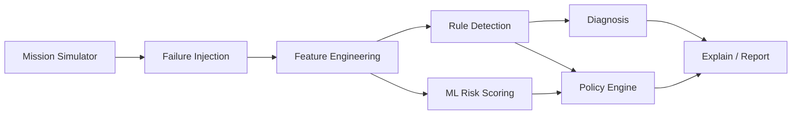

# Architecture

## Design principles

1. **Modular pipeline** — Each stage uses DataFrames and dataclasses; stages are tested independently.
2. **Explainability** — Detections and decisions include plain-language rationale.
3. **ML is advisory** — Rules and policy own abort/emergency; Isolation Forest only scores risk.
4. **Non-operational** — No avionics buses or actuator outputs.

## Pipeline

## Modules

### `autoflight.sim`

- `telemetry_schema.py` — 50+ channels and mission phases.
- `mission_simulator.py` — 1 Hz integrator (climb / cruise / descent / approach).
- `failure_injection.py` — 33 fault handlers applied per tick.

### `autoflight.features`

Rolling trends and ML feature matrix for Isolation Forest.

### `autoflight.detect`

- `rules.py` — Envelope, trend, disagreement rules → `Incident` records.
- `anomaly_ml.py` — Train on early nominal window; score full mission.

### `autoflight.diagnose`

Maps incident codes to likely failure modes (heuristic).

### `autoflight.decide`

- `state_machine.py` — `SafetyState` from incidents + ML flag.
- `policy_engine.py` — Ranks `RecoveryAction` using mission constraint proxies.

### `autoflight.explain`

JSON/Markdown incident reports.

### `autoflight.scenarios`

Built-in presets: `MissionConfig` + `FailureConfig` lists.

### `autoflight.pipeline`

`run_pipeline()` and `run_scenario()` orchestrate the stack.

## Data contracts

| Artifact | Format |
|----------|--------|
| Telemetry | `pd.DataFrame`, 1 Hz |
| Incidents | `List[Incident]` |
| Decision | `Decision` dataclass |
| Report | JSON via `build_incident_report()` |

`app.py` is a thin Streamlit layer over the pipeline.
